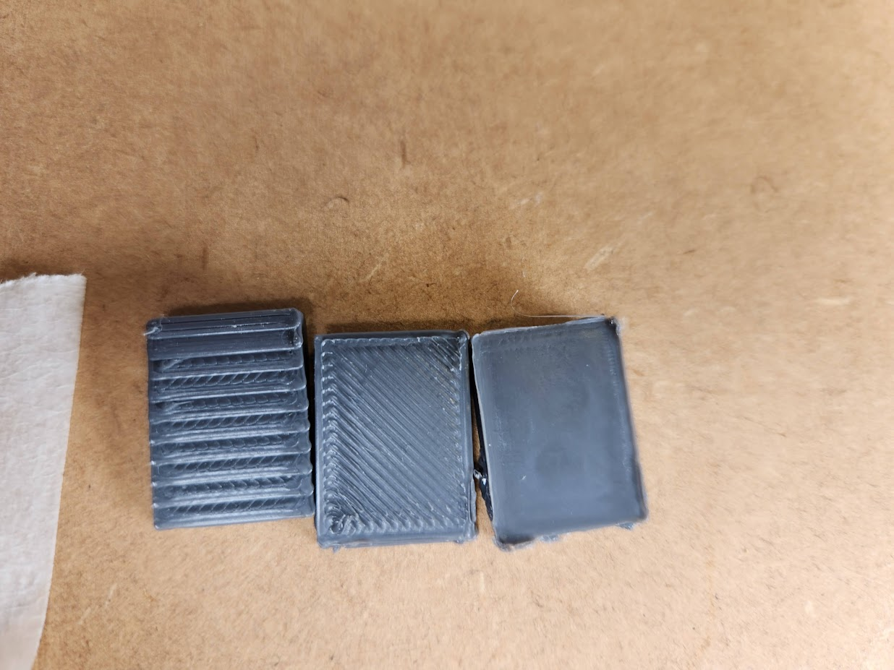
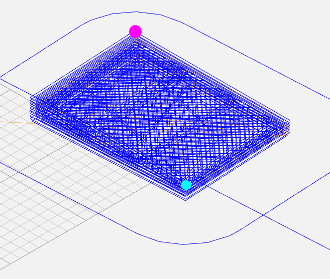

# Non-Planar Ironing

## A novel technique for Smoother Surface Finishes in FDM printing



- Left - Standard printing
- Middle - Best Previous Technique
- Right - Our technique

## Run Non-planar Slic3r

This is based off non-planar slic3r which can be found here (or as a sub-repository):
[https://github.com/Zip-o-mat/Slic3r](https://github.com/Zip-o-mat/Slic3r)

### Slic3r settings

Slic3r has odd defaults, so make sure to set them properly. Things to look out for include:

- Default layer height
- Default Nozzle diameter
- Default filament diameter

## Run the script

Add a file to tge root of this repo named `.input.gcode`. It should have the following content:

```g-code
G1 X0 <YFinal> Z0 E0  ; Get opposite y coordinate (to zig-zag)
G1 <X0> <Y0> <Z0> E0  ; Go to start point
G1 <X1> Y0 <Z1> E0    ; Increment along the XZ plane
G1 <X2> Y0 <Z2> E0
G1 <X3> Y0 <Z3> E0
ETC
```

If a number does not have <> around it it can be value.

The Blue dot below represents point `0`, the pink dot point `Final`.



Then run the `code.ipynb` notebook.
